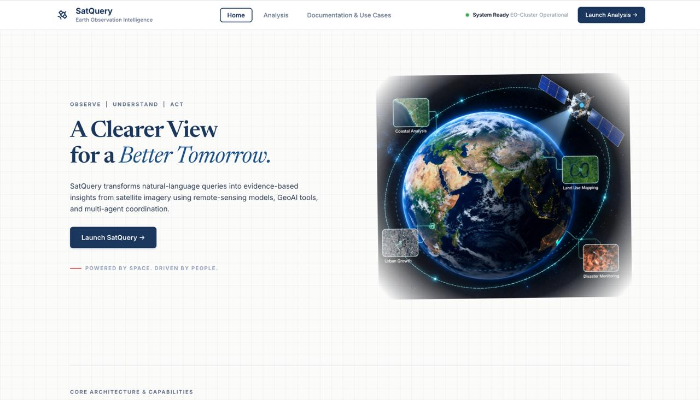

# 🛰️ SatQuery AI

<p align="center">
  
</p>

<p align="center">
  
</p>

<p align="center">
  <b>Observe · Understand · Act</b><br>
  Natural-language intelligence for satellite imagery
</p>

---
------------------------------------------------------------------------


# 🌍 Overview

Satellite imagery contains valuable information about land cover,
agriculture, infrastructure, water bodies, urban development,
environmental change, and many other phenomena. However, extracting this
information often requires specialized remote-sensing knowledge and
task-specific processing pipelines.

**SatQuery AI** is designed to provide a natural-language interface over
these capabilities.

A user can provide:

-   one optical/multispectral image,
-   one SAR image,
-   a pair of images from different time periods,
-   or a co-registered optical + SAR pair,

and ask a question in natural language.

### Example

``` text
User:
[Satellite Image]

Question:
"What type of area is shown in this image?"
```

SatQuery can route the request to the appropriate specialist model and
return an answer together with a confidence estimate.

For a bi-temporal query:

``` text
T1 Image + T2 Image

Question:
"What changed between these two images?"
```

For cross-modal analysis:

``` text
Optical Image + SAR Image

Question:
"What information does the SAR image reveal that complements the optical image?"
```

The long-term goal is to make remote-sensing intelligence accessible
through a **single conversational interface**.

------------------------------------------------------------------------

# 🎯 Problem

Traditional satellite-image analysis often involves several separate
steps:

1.  Identify the imagery type.
2.  Understand the available spectral or SAR bands.
3.  Preprocess the data.
4.  Select a suitable model.
5.  Formulate the task-specific input.
6.  Run the appropriate model.
7.  Interpret the prediction.

This creates a technical barrier for users who may understand the
geographical problem but not the underlying remote-sensing processing
pipeline.

SatQuery addresses this by combining:

-   **Vision-Language Modeling**
-   **Remote-Sensing Adaptation**
-   **Task-Specialist Models**
-   **Bi-Temporal Change Understanding**
-   **Optical--SAR Fusion**
-   **Agentic Routing**

into a unified system.

------------------------------------------------------------------------

# 💡 Solution

``` text
                         ┌─────────────────────┐
                         │       User          │
                         │ Image + Question    │
                         └──────────┬──────────┘
                                    │
                                    ▼
                         ┌─────────────────────┐
                         │   Input Analyzer    │
                         │ modality / temporal │
                         │     configuration   │
                         └──────────┬──────────┘
                                    │
                                    ▼
                         ┌─────────────────────┐
                         │   Agent / Router    │
                         │ Selects capability  │
                         └──────────┬──────────┘
                                    │
              ┌─────────────────────┼─────────────────────┐
              │                     │                     │
              ▼                     ▼                     ▼
        Single Image          Bi-Temporal            Optical + SAR
        Specialist             Specialist             Specialist
              │                     │                     │
              └─────────────────────┼─────────────────────┘
                                    │
                                    ▼
                         ┌─────────────────────┐
                         │ Answer + Confidence │
                         └─────────────────────┘
```

The architecture is modular so specialist capabilities can be developed
and evaluated independently and then connected through the agentic
layer.

------------------------------------------------------------------------

# 🚀 Key Capabilities


## 1. Single-Image VQA

SatQuery processes a single remote-sensing image and answers
natural-language questions.

Example:

``` text
Question: "Is there a water area?"
Answer:   "Yes."
Confidence: 0.xx
```

The primary single-image VQA development uses **RSVQA**.

## 2. Scene Description / Captioning

The system is designed to support natural-language descriptions of
remote-sensing scenes.

Example:

``` text
"The image contains agricultural fields,
scattered buildings, and surrounding vegetation."
```

## 3. Bi-Temporal Change Understanding

SatQuery supports analysis of two images acquired at different times.

``` text
T1 Image ─────┐
              ├──► Change Understanding ──► Change VQA / Description
T2 Image ─────┘
```

The current preparation path uses **CDVQA** for change-oriented visual
question answering.

## 4. Optical--SAR Joint Analysis

Optical and SAR sensors provide complementary information.

``` text
Optical / Multispectral Image
              +
          SAR Image
              ↓
       Cross-Modal Model
              ↓
     Joint Interpretation
```

## 5. Agentic Model Selection

The system is designed to identify the required task configuration
rather than sending every request through one model.

  Input                                   Intended Specialist
  --------------------------------------- --------------------------
  One optical image + question            Single-image VQA
  One image + scene description request   Captioning / description
  Two temporal images + question          Change specialist
  Optical + SAR + question                Fusion specialist
  Complex request                         Agentic sequence

------------------------------------------------------------------------

# 🧠 Model Architecture

The current remote-sensing base combines three visual streams with a
language model.

``` text
RGB Image
    │
    ▼
InternVL3-1B Vision
    │
   MLP1
    │
RGB Tokens [256 × 896]
    │
    ├──────────────────────────────┐
    │                              │
S1 → reBEN S1 → S1 Adapter         │
                  │                │
             S1 Tokens             │
            [256 × 896]             │
                                   │
S2 → reBEN S2 → S2 Adapter         │
                  │                │
             S2 Tokens             │
            [256 × 896]             │
    │                              │
    └──────────────┬───────────────┘
                   ▼
             768 Visual Tokens
                   │
                   ▼
          Qwen2 Language Model
                   │
                  LoRA
                   │
                   ▼
               Text Output
```

Actual concatenation order during RS-base training:

``` text
RGB + S1 + S2
```

Token layout:

``` text
RGB = 256 tokens
S1  = 256 tokens
S2  = 256 tokens

Total = 768 visual tokens
```

------------------------------------------------------------------------

# 🛰️ Remote-Sensing Adaptation

## Base VLM

``` text
OpenGVLab/InternVL3-1B
```

The native RGB branch was explicitly restored and retained so the
RS-adapted checkpoint can support downstream RGB/single-image tasks.

## Sentinel-1

Pretrained encoder:

``` text
BIFOLD-BigEarthNetv2-0/vit_base_patch8_224-s1-v0.1.1
```

Channels:

``` text
VV
VH
```

## Sentinel-2

Pretrained encoder:

``` text
BIFOLD-BigEarthNetv2-0/vit_base_patch8_224-s2-v0.2.0
```

Bands:

``` text
B02 B03 B04 B05 B06 B07 B08 B8A B11 B12
```

## Satellite Adapter

``` text
Input dimension  : 768
Hidden dimension : 1024
Output dimension : 896
Tokens           : 256
```

Each adapter uses learned token queries, LayerNorm, normalized
similarity attention, projection layers, and output normalization.

------------------------------------------------------------------------

# 🔧 Trainable vs Frozen Components

### Trainable

``` text
S1 Adapter
S2 Adapter
Qwen2 LoRA
```

### Frozen

``` text
BigEarthNet S1 encoder
BigEarthNet S2 encoder
InternVL RGB vision encoder
InternVL MLP
Qwen2 base model
```

Approximate trainable parameter counts:

``` text
S1 Adapter : 1,905,792
S2 Adapter : 1,905,792
Qwen2 LoRA : 2,162,688
--------------------------------
Total       : 5,974,272
```

RS-base LoRA:

``` text
r       = 16
alpha   = 32
dropout = 0.05
```

Specialist LoRA:

``` text
r       = 8
alpha   = 32
dropout = 0.10
```

------------------------------------------------------------------------

# 📚 Datasets

## BigEarthNet-v2

Used for the core remote-sensing adaptation.

100K unique S1/S2 pairs were prepared and verified.

Image roots:

``` text
F:\SatQuery\data\images@k\S1
F:\SatQuery\data\images k\S1
F:\SatQuery\data\imagesk\S1

F:\SatQuery\data\images@k\S2
F:\SatQuery\data\images k\S2
F:\SatQuery\data\imagesk\S2
```

Verified:

``` text
S1 images      : 100,000
S2 images      : 100,000
Matching pairs : 100,000
Missing        : 0
```

## RSVQA

Location:

``` text
F:\SatQuery\data\RSVQA
```

Verified:

``` text
Usable VQA records : 57,223
Unique images      : 572
```

Question categories:

``` text
comp
count
presence
rural_urban
```

All usable records were verified to have answers and corresponding TIFF
files.

## CDVQA

Official repository:

``` text
https://github.com/YZHJessica/CDVQA
```

Current preparation flow:

``` text
Repository / annotations
        ↓
JSON verification
        ↓
Actual image acquisition
        ↓
Image-ID matching
        ↓
Dataset construction
        ↓
Change-VQA training
```

Expected annotation files include:

``` text
Train_answers.json
Train_images.json
Train_questions.json

Val_answers.json
Val_images.json
Val_questions.json

Test_answers.json
Test_images.json
Test_questions.json
```

The repository/annotations and actual satellite images are treated as
separate acquisition steps.

------------------------------------------------------------------------

# 🏋️ Training Journey

## Stage 1 --- Original 100K S1/S2 RS Adaptation

Checkpoint:

``` text
F:\SatQuery\checkpoints\satquery_100kinal  raining_state.pt
```

Configuration:

``` text
Data              : 100K
Modalities        : S1 + S2
Optimizer steps   : 12,500
```

This checkpoint is preserved and must not be overwritten.

## Stage 2 --- 100K RGB + S1 + S2 RS Base

A critical architectural issue was identified: the satellite branch had
bypassed InternVL's native RGB vision branch.

The pipeline was corrected before locking the RS base.

Final checkpoint:

``` text
F:\SatQuery\checkpoints\satquery_100k_rgb_baseinal raining_state.pt
```

Result:

``` text
Full epoch        : completed
Optimizer steps   : 12,500
Average loss      : ~0.3057
```

A separate 250-step sanity checkpoint also exists:

``` text
F:\SatQuery\checkpoints\satquery_100k_rgb_sanity_250inal   raining_state.pt
```

This is a sanity checkpoint, not the final RS base.

## Stage 3 --- RGB Compatibility Test

Verified with the RS Base:

``` text
RGB tokens       : [1, 256, 896]
Text embeddings  : [1, 24, 896]
Combined         : [1, 280, 896]
Logits           : [1, 280, 151674]
Forward          : SUCCESS
```

This proves technical RGB compatibility. It does **not** prove high
RGB-only VQA accuracy; specialist task adaptation remains necessary.

## Stage 4 --- RSVQA Specialist Sanity Training

A one-batch test verified:

``` text
RS Base loading       ✓
LoRA merge            ✓
New RSVQA LoRA        ✓
Forward               ✓
Loss                  ✓
Backward              ✓
Gradient update       ✓
Checkpoint save       ✓
Checkpoint reload     ✓
```

Sanity checkpoint:

``` text
F:\SatQuery\checkpoints\satquery_rsvqa_sanity   raining_state.pt
```

## Stage 5 --- Full RSVQA Training

Training dataset:

``` text
57,223 records
1 epoch
```

Unique RGB-token cache:

``` text
F:\SatQuery\cachesvqa_rgb_tokens.pt
```

Target checkpoint:

``` text
F:\SatQuery\checkpoints\satquery_rsvqainal raining_state.pt
```

## Stage 6 --- CDVQA

CDVQA is the current next specialist pipeline.

The first priority is correct data acquisition and verification before
training.

------------------------------------------------------------------------

# 📊 Current Status

  Component                      Status
  ------------------------------ -------------------------
  BigEarthNet RS adaptation      ✅ Complete
  Original 100K S1/S2 base       ✅ Complete
  100K RGB + S1 + S2 RS Base     ✅ Complete
  RGB compatibility test         ✅ Passed
  RSVQA dataset preparation      ✅ Complete
  RSVQA sanity training          ✅ Passed
  Full RSVQA training            🔄 Current/latest stage
  CDVQA repository preparation   🔄 Current
  CDVQA image preparation        ⏳ Next
  CDVQA specialist               ⏳ Pending
  Optical--SAR specialist        ⏳ Planned
  Agentic router                 ⏳ Planned
  Final integration              ⏳ Planned

------------------------------------------------------------------------

# 🗂️ Project Structure

``` text
F:\SatQuery
│
├── data
│   ├── images
│   │   ├── 5k
│   │   │   ├── S1
│   │   │   └── S2
│   │   ├── 40k
│   │   │   ├── S1
│   │   │   └── S2
│   │   └── 100k
│   │       ├── S1
│   │       └── S2
│   │
│   ├── RSVQA
│   │   ├── images
│   │   │   └── Images_LR
│   │   └── splits
│   │
│   ├── CDVQA_repo
│   └── satquery_100000_manifest.csv
│
├── cache
│   └── rsvqa_rgb_tokens.pt
│
├── checkpoints
│   ├── satquery_100k
│   ├── satquery_100k_rgb_base
│   ├── satquery_100k_rgb_sanity_250
│   ├── satquery_rsvqa_sanity
│   └── satquery_rsvqa
│
├── src
│   ├── train_100k_rgb_base_full.py
│   ├── train_rsvqa_rsbase.py
│   └── ...
│
└── satquery_env
```

------------------------------------------------------------------------

# 🧰 Technology Stack

### AI / ML

-   Python 3.11
-   PyTorch
-   Transformers
-   PEFT / LoRA
-   Accelerate
-   timm
-   Lightning

### Remote Sensing

-   BigEarthNet-v2
-   Sentinel-1
-   Sentinel-2
-   Rasterio
-   TIFF / GeoTIFF
-   reBEN pretrained encoders

### Vision-Language

-   InternVL3-1B
-   Qwen2
-   LoRA / PEFT

### Backend

-   FastAPI
-   Uvicorn

### Frontend

-   React
-   TypeScript
-   Vite
-   Tailwind CSS

### Infrastructure

-   NVIDIA RTX A6000
-   Local model/data storage
-   Planned cloud GPU deployment using AWS EC2 where required

------------------------------------------------------------------------

# 🖼️ Data Processing

The user-facing application is intended to hide low-level band
management.

The user should not have to manually provide:

``` text
VV.tif
VH.tif
B02.tif
B03.tif
B04.tif
...
```

Internally:

### Sentinel-1

``` text
VV + VH
```

### Sentinel-2

``` text
B02 B03 B04 B05 B06 B07 B08 B8A B11 B12
```

### RGB

``` text
R = B04
G = B03
B = B02
```

The current RGB adaptation path normalizes reflectance, clips to a valid
range, resizes the image to the InternVL input size, and extracts RGB
tokens.

------------------------------------------------------------------------

# 🎯 Confidence Scores

Every specialist is intended to expose both a result and a confidence
estimate.

Example:

``` json
{
  "answer": "Yes",
  "confidence": 0.91,
  "specialist": "VQA"
}
```

Change VQA:

``` json
{
  "answer": "New construction is visible in the second image.",
  "confidence": 0.84,
  "specialist": "Change-VQA"
}
```

Confidence should eventually be calibrated and evaluated rather than
treated as a guaranteed probability.

------------------------------------------------------------------------

# 🤖 Agentic Orchestration

``` text
                    User Query
                         │
                         ▼
                  Input Analyzer
                         │
                         ▼
                   Agent Router
                         │
          ┌──────────────┼──────────────┐
          ▼              ▼              ▼
         VQA         Change-VQA       Fusion
          │              │              │
          └──────────────┼──────────────┘
                         ▼
                   Final Response
```

The agentic layer is responsible for determining which specialist or
sequence of tools/models should be used.

------------------------------------------------------------------------

# 🖥️ Application Flow

``` text
Open SatQuery
     ↓
Upload image(s)
     ↓
Enter natural-language question
     ↓
Analyze input configuration
     ↓
Select specialist
     ↓
Preprocess imagery
     ↓
Run inference
     ↓
Generate answer + confidence
     ↓
Display result
```

The planned application is intended to provide a feature-rich user
experience rather than a minimal upload-and-answer interface.

------------------------------------------------------------------------

# 📈 Evaluation Plan

## Single-Image VQA

Dataset:

``` text
RSVQA
```

Evaluate:

-   answer correctness,
-   question-type performance,
-   inference stability,
-   confidence behavior.

## Change VQA

Dataset:

``` text
CDVQA
```

Evaluate:

-   change-question answering,
-   temporal reasoning,
-   answer correctness,
-   confidence behavior.

## Remote-Sensing Adaptation

Evaluate whether the adapted representation provides useful downstream
remote-sensing behavior compared with the starting model.

## Optical--SAR Fusion

Evaluate whether the joint model can exploit complementary information
from optical and SAR imagery.

------------------------------------------------------------------------

# 🛣️ Development Roadmap

``` text
BigEarthNet Adaptation
          │
          ▼
     RS Base v1
   RGB + S1 + S2
          │
    ┌─────┼─────┐
    ▼     ▼     ▼
  RSVQA  CDVQA  Captioning
    │     │     │
    └─────┼─────┘
          ▼
   Specialist Layer
          │
          ▼
 Optical–SAR Fusion
          │
          ▼
   Agentic Router
          │
          ▼
     SatQuery App
          │
          ▼
   Cloud Deployment
```

Immediate priority:

``` text
Finish RSVQA
      ↓
Prepare CDVQA data
      ↓
Train CDVQA specialist
      ↓
Build change inference
      ↓
Optical–SAR fusion
      ↓
Agentic orchestration
      ↓
Final UI/backend integration
      ↓
Deployment + demonstration
```

------------------------------------------------------------------------

# ⚠️ Limitations and Prototype Scope

SatQuery is a **research/prototype system**, not a production-scale
global satellite intelligence platform.

Current limitations include:

1.  Specialist performance depends on available training data.
2.  Technical compatibility does not automatically imply high task
    accuracy.
3.  The RS Base uses a specific multimodal token configuration.
4.  RGB-only compatibility has been technically verified, but useful
    RGB-only VQA requires task adaptation.
5.  CDVQA preparation and specialist training are still in progress.
6.  Optical--SAR fusion is a separate capability and is not
    interchangeable with bi-temporal change analysis.
7.  Confidence values require calibration and evaluation.
8.  The prototype is being developed under limited time and compute
    constraints.

------------------------------------------------------------------------

# 🔐 Checkpoint Management

Important checkpoints are intentionally kept separate.

``` text
satquery_100k
        │
        ├── Original 100K RS checkpoint
        │
        ▼
satquery_100k_rgb_base
        │
        ├── Current RS Base v1
        │
        ├── satquery_100k_rgb_sanity_250
        │
        ▼
satquery_rsvqa
        │
        └── RSVQA specialist
```

Original checkpoints should never be overwritten during specialist
development.

------------------------------------------------------------------------

# 💻 Environment

``` text
OS             : Windows Server 2016
Python         : 3.11
Environment    : satquery_env
Project root   : F:\SatQuery
GPU            : NVIDIA RTX A6000
```

The development environment also includes the reBEN training scripts and
required dependencies such as:

``` text
lmdb
lightning.pytorch
configilm
```

------------------------------------------------------------------------

# 👥 Team

## VisionX

-   **Afsar Azam**
-   **Ayush Singh**
-   **Lalita Jhapate**
-   **Abhi Jain**
-   **Shivam Kumar**
-   **Abhinav Saini**

------------------------------------------------------------------------

# 📚 References

### InternVL

https://github.com/OpenGVLab/InternVL

### BigEarthNet

https://bigearth.net/

### BigEarthNet-v2 pretrained models

https://huggingface.co/BIFOLD-BigEarthNetv2-0

### CDVQA

https://github.com/YZHJessica/CDVQA

### Hugging Face PEFT

https://github.com/huggingface/peft

### Transformers

https://github.com/huggingface/transformers

### PyTorch

https://pytorch.org/

------------------------------------------------------------------------

# 🌌 Project Vision

> **SatQuery AI aims to turn complex remote-sensing analysis into a
> natural-language interaction.**

Instead of requiring users to understand sensors, bands, preprocessing
pipelines, and specialized model selection, SatQuery is being built
around a simple interaction:

``` text
Upload imagery.
      ↓
Ask a question.
      ↓
SatQuery understands the task.
      ↓
The appropriate specialist is selected.
      ↓
The imagery is analyzed.
      ↓
The answer + confidence are returned.
```

SatQuery brings together:

**Remote-Sensing Representation Learning + Vision-Language Modeling +
Task Specialists + Temporal Reasoning + Multimodal Fusion + Agentic
Orchestration**

into one unified prototype.

------------------------------------------------------------------------

## ⭐ SatQuery AI

**See the Earth. Understand the Question. Query the Satellite.**
